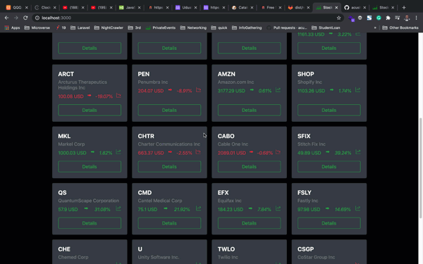

# STOCKIST WEB APP - REACT CAPSTONE PROJECT

The project, a frontend web application, catalogue of financial values using [Stock API](https://financialmodelingprep.com/developer/docs/)  and collect the data from my React Application.

The application features includes:
- Listing of Most Active Stocks
- Listing of Most Gainer's Stocks
- Listing of Most Loser's Stocks
- Filter between those 3, most active, gainers and losers
- Open individual stock item
- Search for a particular stock item, example 'AAPL'
- Listing of the lastest stock news
- Dynamic routes for individual stock item, example `/stocks/AAPL`



## Live Demo
[Live Demo]

## Getting Started

To get a local copy up and running follow these simple example steps.

### Prerequisites

Make sure Node.js is running on your local machine

### Setup

~~~bash
$ git clone https://github.com/rebel216/Capstone-React-Finance.git
$ cd Capstone-React-Finance
~~~

Install modules:

```
yarn add
```

Setup your API Key

- I used the [Financial Modelling Prep API](https://financialmodelingprep.com/developer/docs/). Signup and get your key.
- Create `.env` file, open it and add `REACT_APP_API_KEY=xxxxxxxxxxxxxxxxxxxxx`
- Add 'SKIP_PREFLIGHT_CHECK=true' to '.env' file.

### Usage

Start server with:

```
    yarn start or npm start
```
### Running Test
Jest is used to run all the tests found in this application
In order to run the test you can simply type `yarn test` or `npm run test`

# Authors

👤 **Neeraj Bhardwaj**

- Github: [@rebel216](https://github.com/rebel216/)
- Twitter: [@rebel216](https://twitter.com/rebel216)
- Linkedin: [rebel216](https://www.linkedin.com/in/rebel216/)

## 🤝 Contributing

Contributions, issues and feature requests are welcome!

Feel free to check the [issues page](issues/).

## Show your support

Give a ⭐️ if you like this project!

## Acknowledgments
- [Microverse Inc](https://www.microverse.org/)
- [Financial Modelling Prep API](https://financialmodelingprep.com/developer/docs/)